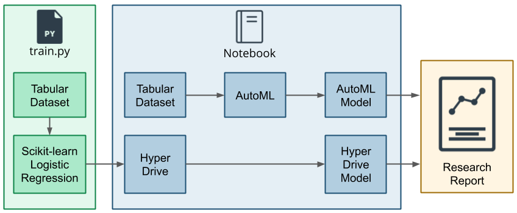
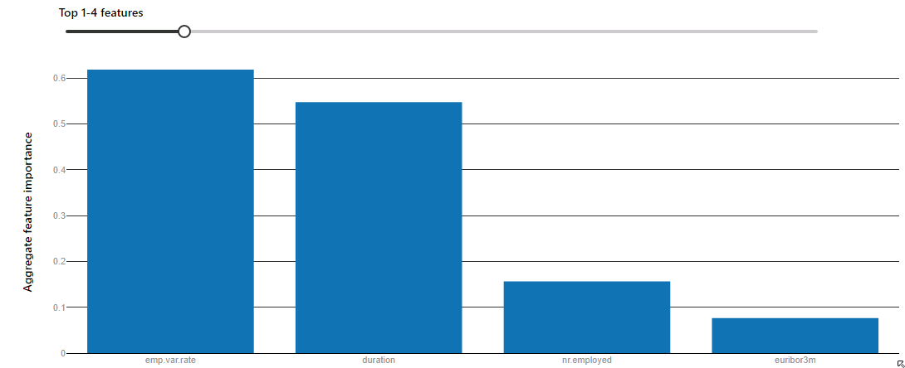

# Udacity Machine Learning Engineer with Microsoft Azure Nanodegree - Project: Optimizing an ML Pipeline in Azure

- [Overview](#overview)
- [Summary](#summary)
- [Scikit-learn Pipeline](#scikit-learn-pipeline)
  - [Data collection, cleansing and splitting](#data-collection-cleansing-and-splitting)
  - [Hyperparameter sampling](#hyperparameter-sampling)
  - [Model training and testing](#model-training-and-testing)
  - [Applying early stopping policy](#applying-early-stopping-policy)
  - [Saving model](#saving-model)
- [AutoML](#automl)
- [Pipeline comparison](#pipeline-comparison)
- [Future work](#future-work)
- [References](#references)
- [Requirements](#requirements)
- [License](#license)

## Overview

This project is part of the Udacity Azure ML Nanodegree. It builds and optimizes an Azure ML pipeline using the Python SDK and a provided scikit-learn model. The model is then compared to an Azure AutoML run.

## Summary

The [dataset](https://automlsamplenotebookdata.blob.core.windows.net/automl-sample-notebook-data/bankmarketing_train.csv) contains direct marketing campaign data of a banking institute. The data contains 20 features such as age, job, marital status, etc. The target column contains the categories "yes" and "no", to determine if the client subscribed to the bank's term deposit.

In this project I did the following:

- Tuned the hyperparameters of the [LogisticRegression](https://scikit-learn.org/stable/modules/generated/sklearn.linear_model.LogisticRegression.html) model using [Hyperdrive](https://docs.microsoft.com/en-us/python/api/azureml-train-core/azureml.train.hyperdrive?view=azure-ml-py) achieving an accuracy of 90.97% for a `C` value of 17.57 and `max_iter` value of 100
- Employed AutoML to find the best algorithm and got accuracy of 91.70% with [VotingEnsemble](https://scikit-learn.org/stable/modules/generated/sklearn.ensemble.VotingClassifier.html)

The diagram below shows the main steps of creating and optimizing the ML pipeline executed in this project:

The following pictures provides an overview on how experiments are run in Azure:

## Scikit-learn Pipeline

The pipeline uses a scikit-learn [LogisticRegression](https://scikit-learn.org/stable/modules/generated/sklearn.linear_model.LogisticRegression.html) model together with HyperDrive for hyperparameter tuning:

- [Data collection, cleansing and splitting](#data-collection-cleansing-and-splitting)
- [Hyperparameter sampling](#hyperparameter-sampling)
- [Model training and testing](#model-training-and-testing)
- [Applying early stopping policy](#applying-early-stopping-policy)
- [Saving model](#saving-model)

The script `train.py` takes care of data collection, cleansing and splitting, model training and testing. Hyperparameter sampling and applying the early stopping policy is performed by HyperDrive.

### Data collection, cleansing and splitting

The dataset is loaded using `TabularDatasetFactory`. The cleansing process drops rows with empty values and performs one hot encoding for categorical columns. The dataset is split into train and test sets. 70% of the data is used for training and 30% for testing.

### Hyperparameter sampling

The project uses two hyperparameters:

- `--C`: inverse regularization strength
- `--max_iter`: maximum iteration to converge for the scikit-learn Logistic Regression model

I use [random parameter sampling](https://docs.microsoft.com/en-us/python/api/azureml-train-core/azureml.train.hyperdrive.randomparametersampling?view=azure-ml-py). Random sampling supports discrete and continuous hyperparameters. It supports early termination of low-performance runs. In random sampling, hyperparameter values are randomly selected from the defined search space. Random parameter sampling is good approach for discovery learning as well as hyperparameter combinations.

### Model training and testing

Model training and testing is performed using scikit-learn's Logistical Regression model. In `train.py`, metrics are generated and logged. The accuracy is used to benchmark the model.

### Applying early stopping policy

The execution of the pipeline is stopped if the conditions specified by the policy are met.

The model uses [BanditPolicy](https://docs.microsoft.com/en-us/python/api/azureml-train-core/azureml.train.hyperdrive.banditpolicy?view=azure-ml-py).

Bandit policy is based on slack factor/slack amount and evaluation interval. Bandit ends runs when the primary metric isn't within the specified slack factor/slack amount of the most successful run.

### Saving model

The best model is saved with `joblib`.

## AutoML

AutoML tries different models and algorithms and tunes the process within a specified period of time. The steps taken to implement AutoML were as follows:

- Import the dataset using `TabularDatasetFactory`
- Split it into train and test sets
- Run AutoML and save the best performing model (see [AutoMLConfig Class](https://docs.microsoft.com/en-us/python/api/azureml-train-automl-client/azureml.train.automl.automlconfig.automlconfig?view=azure-ml-py) for the documentation of the AutoML configuration parameters)

The Voting Ensemble model performed the best and provided an accuracy of 91.70%.

The top 4 features contributing to the classification performance are `emp.var.rate`, `duration`, `nr.employed`, `euribor3m`. The following dependence plot shows the relationship between the value of a feature to the corresponding importance of the feature across a cohort:

## Pipeline comparison

Besides achieving a better accuracy, AutoML has the following additional benefits compared to the manually trained model using hyperparameter turing:

- Leads to a simpler architecture as less steps are required
- Allows for easy testing of several different ML models automatically selecting the best performing
- Supports automatic data cleansing and pre-processing

## Future work

Some areas of improvement for future experiments:

- The dataset is imbalanced: Address bias before running the AutoML pipeline to reduce the bias (see [Detect and mitigate unfairness in models with Azure Machine Learning](https://docs.microsoft.com/en-us/learn/modules/detect-mitigate-unfairness-models-with-azure-machine-learning/))
- Feature engineering in addition to hyperparameter tuning should also lead to better model performance (see [Feature engineering in machine learning](https://docs.microsoft.com/en-us/azure/machine-learning/team-data-science-process/create-features) and [Data featurization in automated machine learning](https://docs.microsoft.com/en-us/azure/machine-learning/how-to-configure-auto-features))
- Increasing AutoML experiment timeout: Enables more model testing and evaluation to come up with better performance metrics

## References

- [What is Azure Machine Learning?](https://docs.microsoft.com/en-us/azure/machine-learning/overview-what-is-azure-ml)
- [What is automated machine learning (AutoML)?](https://docs.microsoft.com/en-us/azure/machine-learning/concept-automated-ml)
- [Create an Azure Machine Learning workspace](https://docs.microsoft.com/en-us/learn/modules/use-automated-machine-learning/create-workspace)
- [Create compute resources](https://docs.microsoft.com/en-us/learn/modules/use-automated-machine-learning/create-compute)
- [Explore Azure Machine Learning with Jupyter Notebooks](https://docs.microsoft.com/en-us/azure/machine-learning/samples-notebooks)
- [Run Jupyter Notebooks in your workspace](https://docs.microsoft.com/en-us/azure/machine-learning/how-to-run-jupyter-notebooks)
- [Describe data ingestion and processing](https://docs.microsoft.com/en-us/learn/modules/explore-concepts-of-data-analytics/2-describe-data-ingestion-process)
- [Detect data drift (preview) on datasets](https://docs.microsoft.com/en-us/azure/machine-learning/how-to-monitor-datasets?tabs=python)
- [Azure Open Datasets](https://azure.microsoft.com/en-us/services/open-datasets/)
- [What is Azure Machine Learning designer?](https://docs.microsoft.com/en-us/azure/machine-learning/concept-designer)
- [What are Azure Machine Learning pipelines?](https://docs.microsoft.com/en-us/azure/machine-learning/concept-ml-pipelines)
- [Tune Model Hyperparameters](https://docs.microsoft.com/en-us/azure/machine-learning/studio-module-reference/tune-model-hyperparameters)
- [What is the Azure Machine Learning SDK for Python?](https://docs.microsoft.com/en-us/python/api/overview/azure/ml/?view=azure-ml-py)
- [Hyperparameter tuning a model with Azure Machine Learning](https://docs.microsoft.com/en-us/azure/machine-learning/how-to-tune-hyperparameters)
- [Configure automated ML experiments in Python](https://docs.microsoft.com/en-us/azure/machine-learning/how-to-configure-auto-train)
- [Use the interpretability package to explain ML models & predictions in Python (preview)](https://docs.microsoft.com/en-us/azure/machine-learning/how-to-machine-learning-interpretability-aml)

## Requirements

Graded according to the [Project Rubric](https://review.udacity.com/#!/rubrics/2925/view).

## License

- **[MIT license](http://opensource.org/licenses/mit-license.php)**
- Copyright 2021 © [Thomas Weibel](https://github.com/thom).
