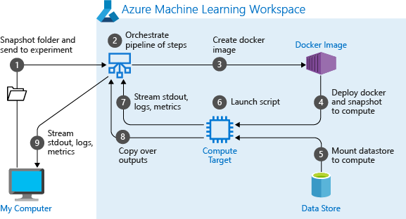

# Udacity Machine Learning Engineer with Microsoft Azure Nanodegree - Project: Optimizing an ML Pipeline in Azure

- [Overview](#overview)
- [Summary](#summary)
- [Scikit-learn Pipeline](#scikit-learn-pipeline)
- [AutoML](#automl)
- [Pipeline comparison](#pipeline-comparison)
- [Future work](#future-work)
- [Proof of cluster clean up](#proof-of-cluster-clean-up)
- [References](#references)
- [Requirements](#requirements)
- [License](#license)

## Overview

This project is part of the Udacity Azure ML Nanodegree. It builds and optimizes an Azure ML pipeline using the Python SDK and a provided scikit-learn model. The model is then compared to an Azure AutoML run.

The diagram below shows the main steps of creating and optimizing an ML pipeline:

## Summary
**In 1-2 sentences, explain the problem statement: e.g "This dataset contains data about... we seek to predict..."**

**In 1-2 sentences, explain the solution: e.g. "The best performing model was a ..."**

## Scikit-learn Pipeline
**Explain the pipeline architecture, including data, hyperparameter tuning, and classification algorithm.**

**What are the benefits of the parameter sampler you chose?**

**What are the benefits of the early stopping policy you chose?**

## AutoML
**In 1-2 sentences, describe the model and hyperparameters generated by AutoML.**

## Pipeline comparison
**Compare the two models and their performance. What are the differences in accuracy? In architecture? If there was a difference, why do you think there was one?**

## Future work
**What are some areas of improvement for future experiments? Why might these improvements help the model?**

## Proof of cluster clean up
**If you did not delete your compute cluster in the code, please complete this section. Otherwise, delete this section.**
**Image of cluster marked for deletion**

## References

- [What is Azure Machine Learning?](https://docs.microsoft.com/en-us/azure/machine-learning/overview-what-is-azure-ml)
- [What is automated machine learning (AutoML)?](https://docs.microsoft.com/en-us/azure/machine-learning/concept-automated-ml)
- [Create an Azure Machine Learning workspace](https://docs.microsoft.com/en-us/learn/modules/use-automated-machine-learning/create-workspace)
- [Create compute resources](https://docs.microsoft.com/en-us/learn/modules/use-automated-machine-learning/create-compute)
- [Explore Azure Machine Learning with Jupyter Notebooks](https://docs.microsoft.com/en-us/azure/machine-learning/samples-notebooks)
- [Run Jupyter Notebooks in your workspace](https://docs.microsoft.com/en-us/azure/machine-learning/how-to-run-jupyter-notebooks)
- [Describe data ingestion and processing](https://docs.microsoft.com/en-us/learn/modules/explore-concepts-of-data-analytics/2-describe-data-ingestion-process)
- [Detect data drift (preview) on datasets](https://docs.microsoft.com/en-us/azure/machine-learning/how-to-monitor-datasets?tabs=python)
- [Azure Open Datasets](https://azure.microsoft.com/en-us/services/open-datasets/)
- [What is Azure Machine Learning designer?](https://docs.microsoft.com/en-us/azure/machine-learning/concept-designer)
- [What are Azure Machine Learning pipelines?](https://docs.microsoft.com/en-us/azure/machine-learning/concept-ml-pipelines)
- [Tune Model Hyperparameters](https://docs.microsoft.com/en-us/azure/machine-learning/studio-module-reference/tune-model-hyperparameters)
- [What is the Azure Machine Learning SDK for Python?](https://docs.microsoft.com/en-us/python/api/overview/azure/ml/?view=azure-ml-py)
- [Hyperparameter tuning a model with Azure Machine Learning](https://docs.microsoft.com/en-us/azure/machine-learning/how-to-tune-hyperparameters)
- [Configure automated ML experiments in Python](https://docs.microsoft.com/en-us/azure/machine-learning/how-to-configure-auto-train)
- [Use the interpretability package to explain ML models & predictions in Python (preview)](https://docs.microsoft.com/en-us/azure/machine-learning/how-to-machine-learning-interpretability-aml)

## Requirements

Graded according to the [Project Rubric](https://review.udacity.com/#!/rubrics/2925/view).

## License

- **[MIT license](http://opensource.org/licenses/mit-license.php)**
- Copyright 2021 © [Thomas Weibel](https://github.com/thom).
